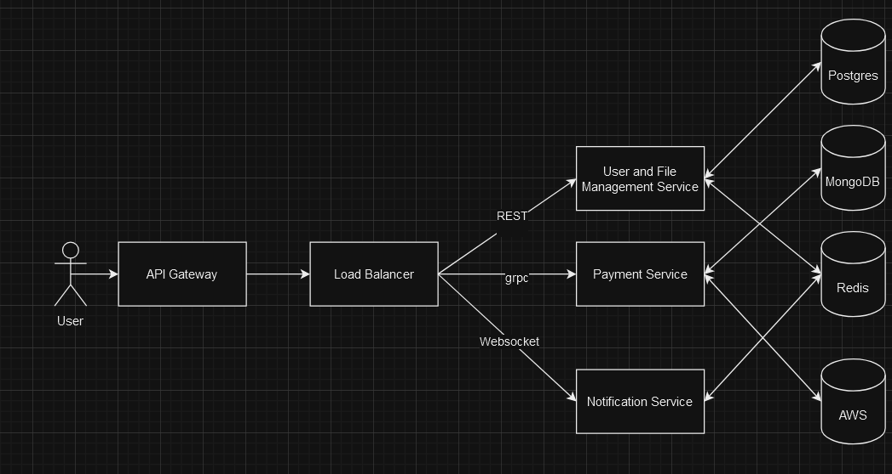
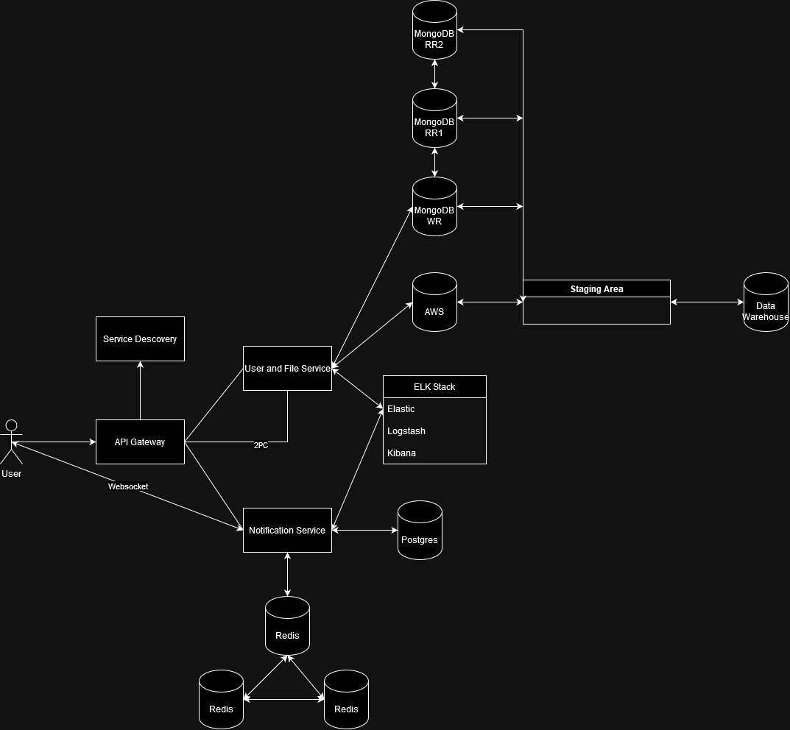

# Beats Marketplace Microservices Application

## Application Suitability

1. **Why is this application relevant?**
   - The music industry is increasingly shifting to digital platforms for purchasing, sharing, and promoting beats. Beat marketplaces like BeatStars are at the forefront of this movement, enabling creators to sell and musicians to buy high-quality beats.
   - A decentralized and modular platform like this is ideal for independent musicians who want to access beats globally and efficiently. Having services like chat, purchasing, and music streaming handled independently improves reliability and scalability.

2. **Why does this application require a microservice architecture?**
   - A Beats Marketplace requires several distinct components, such as beat upload management, user authentication, purchasing, and chat functionalities. Each service can be developed, deployed, and scaled independently.
   - If one service fails (e.g., chat service), the other services (e.g., music player, purchasing) can continue operating, increasing reliability. This architecture also allows different teams to work on separate services without interfering with each other’s work.

## Service Boundaries




- **User Management Service**: Handles user authentication, registration, profile management, and account settings.
- **File Management Service**: Manages file uploads, storage, and streaming of music beats. Includes beat metadata and file conversions.
- **Purchasing Service**: Manages purchases, payment processing, and transaction records.
- **Chat Service**:  Provides real-time messaging between users (e.g., for negotiating purchases or collaborations).
- **Notification Service**: Manages real-time notifications for users, such as purchase confirmations, beat uploads, or messages from other users.

## Technology Stack and Communication Patterns

- **User Management Service**
  Backend: Python (Flask or FastAPI)
  Database: MongoDB (for storing user profiles)
  -ession Management: Redis

- **File Management Service**
  Backend: Python (Flask or FastAPI)
  Storage: AWS S3 (for storing audio files)
  Database: MongoDB (for storing file metadata)
  Audio Processing: FFMPEG (for file conversions and streaming)

- **Purchasing Service**
  Backend: Python (Flask or FastAPI)
  Payment Integration: Stripe API (for payment handling)
  Database: MongoDB (for storing purchase history)
 
- **Chat Service**
  Backend: JavaScript (Node.js with WebSocket)
  Cache: Redis (for storing chat states)
  Messaging: RabbitMQ (for message queues)

- **Notification Service**
  Backend: JavaScript (Node.js with WebSocket for real-time notifications)
  Cache: Redis (for storing notification states)
  Messaging: RabbitMQ (for sending notifications asynchronously)
### Communication
- **Inter-Service Communication**: REST APIs will be used for synchronous communication between the services, with RabbitMQ handling asynchronous messaging for tasks such as sending notifications or processing beat uploads.
  
## Data Management

* **User Management Service**:
  ```json
  POST /api/users/signup 
    {
      "username": "example_user",
      "email": "example@example.com",
      "password": "password"
    }
    
    POST /api/users/login
    {
      "email": "example@example.com",
      "password": "password"
    }
    
    GET /api/users/profile
    {
      "username": "example_user",
      "email": "example@example.com",
      "purchased_beats": ["beat1", "beat2"]
    }
    
    PUT /api/users/profile/update
    {
      "username": "new_user_name",
      "email": "new_email@example.com"
    }
    
    POST /api/users/logout
    {
      "token": "user-session-token"
    }
* **File Management Service**:
  ```json
  
   POST /api/beats/upload
    {
      "title": "Chill Vibes",
      "artist": "Producer A",
      "file_url": "s3://path_to_beat"
    }
    
    GET /api/beats/{beat_id}
    {
      "beat_id": "12345",
      "title": "Chill Vibes",
      "artist": "Producer A",
      "file_url": "s3://path_to_beat",
      "price": 50
    }
    
    GET /api/beats/stream/{beat_id}
    {
      "beat_id": "12345",
      "stream_url": "https://streaming_url_for_beat"
    }
    
    DELETE /api/beats/{beat_id}/delete
    {
      "beat_id": "12345"
    }
* **Notification Service**:
  ```json
  GET /api/notifications
    {
      "user_id": "54321",
      "notifications": [
        {
          "type": "purchase",
          "message": "Your beat has been successfully purchased",
          "status": "unread"
        },
        {
          "type": "message",
          "message": "You have a new message from User B",
          "status": "unread"
        }
      ]
    }
    
    POST /api/notifications/mark-as-read
    {
      "notification_id": "98765"
    }
    
    WebSocket Endpoint: ws://notifications/{user_id}
    {
      "type": "real-time notification",
      "message": "You have a new message",
      "status": "unread"
    }
* **Chat Service**:
  ```json
  POST /api/chat/send
    {
      "sender": "Producer A",
      "receiver": "User B",
      "message": "Let's collaborate!"
    }
    
    GET /api/chat/messages/{chat_id}
    {
      "chat_id": "98765",
      "messages": [
        {
          "sender": "Producer A",
          "content": "Let's collaborate!"
        },
        {
          "sender": "User B",
          "content": "Sure, let's do it!"
        }
      ]
    }
    
    GET /api/chat/history/{user_id}
    {
      "user_id": "54321",
      "chats": [
        {
          "chat_id": "98765",
          "participants": ["Producer A", "User B"]
        }
      ]
    }
    
    WebSocket Endpoint: ws://chat/{user_id}
    {
      "type": "real-time message",
      "message": "New message from Producer A"
    }

 
  

## Deployment and Scaling

1. **Deployment:**
   Each microservice will be deployed in individual Docker containers to ensure portability and isolated environments. Docker  will be used to coordinate the deployment of all services together.

2. **Scaling:**
   Services will be horizontally scalable using Kubernetes for orchestration, allowing multiple instances of services like the Music Player and Beat Upload service to handle large traffic volumes efficiently.


## Laboratory 2

### Updated System Diagram



### Theoretical Description of New System Additions

1. **Service Discovery**:
   - The addition of a Service Discovery component ensures that services in the system can dynamically locate each other without needing hard-coded addresses. This enhances scalability and resilience by allowing services to be added or removed seamlessly.

2. **ELK Stack (Elasticsearch, Logstash, and Kibana)**:
   - **Purpose**: The ELK stack is incorporated for centralized logging and monitoring of all services within the system. It collects logs, processes them, and visualizes them for easy analysis.
   - **Integration**: Both the **User and File Service** and the **Notification Service** are connected to the ELK stack to provide real-time logs and metrics, enabling better observability and troubleshooting.

3. **Data Warehouse**:
   - **Description**: A data warehouse has been introduced to store and analyze data aggregated from both **MongoDB** and **AWS**.
   - **Staging Area**: The staging area acts as an intermediary where data from **MongoDB** (primary and replicated nodes) and **AWS** is cleaned and formatted before being loaded into the data warehouse.

4. **Redis Replication**:
   - **Details**: Replication has been added for **Redis** to improve the high availability of the **Notification Service**. Multiple Redis instances ensure that if one instance fails, the others can continue to handle requests, maintaining service continuity.

6. **2-Phase Commit Protocol (2PC)**:
   - **Purpose**: Implemented in the **User and File Service** to ensure data consistency when operations span multiple services or databases. This protocol coordinates transactions to commit or roll back changes to maintain data integrity.

7. **Data Redundancy and Replication for MongoDB**:
   - **Setup**: The main **MongoDB** instance (WR) writes data, and replicated instances (RR1 and RR2) provide read redundancy and improve data availability. This setup ensures that data remains accessible even if the primary instance goes down.
  
### Postman Collection and Endpoint hierarchy
* **UserFile Service**:
```json
POST url/user/login
{ 
  "email": "email",
  "password": "password"
}

POST url/user/signup
{
  "username": "username",
  "email": "email",
  "password": "password"
}
POST url/beats/upload
{
     
      "title": "Chill Vibes",
      "artist": "Producer A",
      "beat": "s3://path_to_beat"
}
```
* **Notification Service**:
```json
POST url/notify-login
{
"empty"
}
POST url/notify-signup
{
"empty"
}
Websocket url
{
  "action": "join",
  "room": "notify-upload"
}
Websocket url
{
  "action": "join",
  "room": "notify-login"
}
Websocket url
{
  "action": "join",
  "room": "notify-signup"
}
```
* **Service Descovery**:
```json
POST url/register
{
  "service_name": "service_name_",
  "service_address": "service_address",
  "service_port": "service_port"
}
GET url/status
{
  "empty"
}
```
### Important
To test the endpoints you must first signup, then login and add the JWT token to the bearer in Authentication

### Deployment and testing
To deploy the ptoject and test docker images run **docker-compose up**. 


### Conclusion
These additions enhance the reliability, scalability, and observability of the Beats Marketplace system. By incorporating service discovery, the ELK stack, data replication, and warehousing, the system is better equipped to handle large-scale operations and ensure data consistency and high availability.
